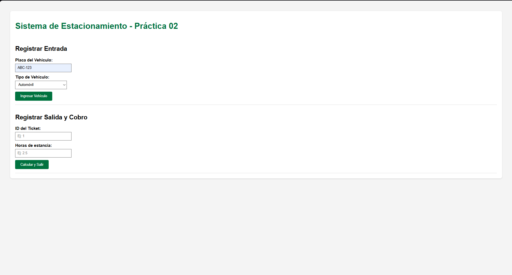
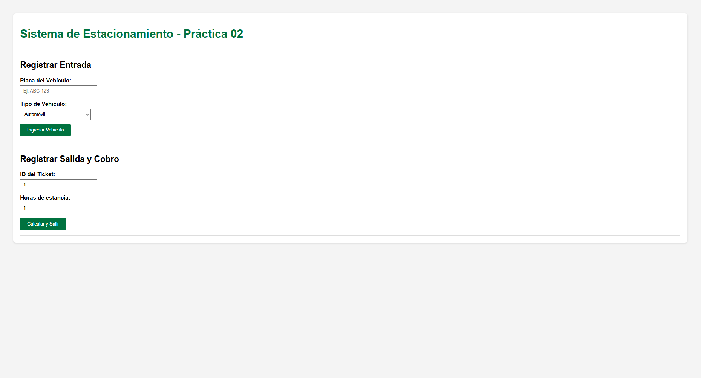

+++
date = '2026-02-20T23:15:19-08:00'
draft = false
title = 'Practica2: El paradigma orientado a objetos'
+++

## __Introduccion__

### __Contexto del Problema__
La gestión de un estacionamiento demanda un control riguroso sobre la disponibilidad de espacios y la aplicación de tarifas dinámicas según la categoría del vehículo. Los procesos manuales suelen presentar inconsistencias en la asignación de cajones (ej. permitir un automóvil en un área exclusiva para motocicletas) y errores en el cálculo de importes por tiempo de estancia.

### __Objetivos__
- Desarrollar un sistema de gestión integral utilizando el paradigma de Programación Orientada a Objetos (POO).
- Validar la implementación de los pilares de la POO: Encapsulación, Herencia, Polimorfismo y Abstracción.
- Estructurar la solución bajo el patrón de arquitectura Modelo-Vista-Controlador (MVC) utilizando el micro-framework Flask.


## __Modelo del Dominio__

### __Diagrama UML__
El diseño arquitectónico se fundamenta en una jerarquía de vehículos y una relación de composición con los espacios de estacionamiento, mediada por una abstracción de políticas de cobro.

### __Lista de Clases y Responsabilidades__
Vehicle (Clase Base): Entidad abstracta que centraliza los atributos comunes como la placa y el tipo.

- __Car / Motorcycle (Subtipos):__ Implementaciones concretas que permiten aplicar reglas de negocio específicas.
- __ParkingSpot:__ Responsable de gestionar su estado de ocupación y validar la compatibilidad técnica del vehículo entrante.
- __ParkingLot (Controlador de Dominio):__ Orquestador principal que administra la colección de cajones, gestiona la entrada/salida y la persistencia en memoria.
- __RatePolicy (Interfaz):__ Abstracción que define el contrato para el cálculo de costos, desacoplando la lógica financiera del núcleo del sistema.


## __Evidencia de Conceptos POO__

1. __Encapsulación:__
Se implementó mediante el uso de atributos privados (prefijo __), asegurando que el estado interno solo sea modificable a través de métodos públicos que validan la operación.

```Python

def occupy(self, vehicle):
    if self.__occupied:
        return False 
    self.__vehicle = vehicle
    self.__occupied = True
    return True

```

2. __Abstracción:__
Se utilizó typing.Protocol para definir la política de cobro. El sistema interactúa con la interfaz sin conocer la implementación interna de las tarifas.

```Python

class RatePolicy(Protocol):
    def calculate(self, hours: float, vehicle: Vehicle) -> float:

```

3. __Composicion:__
La clase ParkingLot no hereda de los espacios, sino que se compone de una colección de objetos ParkingSpot, delegando en ellos la gestión de su propio estado.

```Python

class ParkingLot:
    def __init__(self, policy):
        self.__spots = [ParkingSpot("A1", VehicleType.CAR), ...]

```

4. __Herencia y Subtipos:__
Se extendió la funcionalidad de Vehicle para crear categorías especializadas, permitiendo que el sistema realice búsquedas de cajones basadas en el tipo de objeto.

```Python

class Car(Vehicle):
    def __init__(self, plate: str):
        super().__init__(plate, VehicleType.CAR)

```

5. __Polimorfismo:__
El método de cálculo de tarifa reacciona dinámicamente al tipo de vehículo procesado, aplicando costos diferenciados bajo una misma firma de método.

```Python

def calculate(self, hours: float, vehicle: Vehicle) -> float:
    if vehicle.type == VehicleType.CAR:
        return hours * 15.0 
    return hours * 10.0

```


## __MVC con Flask__

La aplicación se estructuró para separar la lógica de negocio de la interfaz de usuario:

- __Modelo (Model):__ Ubicado en la carpeta models/, contiene la lógica pura de Python y reglas de dominio.
- __Vista (View):__ Plantillas HTML en templates/ que actúan como interfaz para el usuario final.
- __Controlador (Controller):__ Archivo app.py, encargado de gestionar las peticiones HTTP y coordinar los flujos entre el modelo y la vista.


## __Pruebas Manuales__






## __Coclusion__

Al terminar esta práctica, lo más interesante no fue solo ver que el código funcionaba, sino entender por qué la POO y el MVC te salvan la vida cuando el proyecto crece. Al principio, en la Sesión 1 y 2, todo parecía muy teórico con las clases y los punteros, pero al llegar a la Sesión 3 y conectar Flask, me di cuenta de que si el "Modelo" (la lógica del estacionamiento) está bien hecho, la interfaz web es solo una "cara" más. Pude conectar los formularios de HTML sin tener que reescribir ni una sola función de mis clases originales, lo cual demuestra que el código es realmente modular.

También me sirvió mucho para aterrizar conceptos que a veces se quedan en el aire. Por ejemplo, el polimorfismo se vuelve súper claro cuando ves que una sola función de cobro puede tratar de forma distinta a un carro y a una moto sin llenar el código de if/else interminables. Además, el trabajar con Flask te abre los ojos sobre cómo funcionan las aplicaciones que usamos a diario: esa separación entre lo que el usuario ve (Vista), lo que el servidor procesa (Controlador) y las reglas del negocio (Modelo) es lo que permite que los sistemas no se vuelvan un caos de espagueti. En resumen, la práctica me ayudó a pasar de "hacer que el código corra" a "diseñar una arquitectura" que sea fácil de mantener y escalar.

## __Referencias__ 

- classes. (s. f.). Python Documentation. https://docs.python.org/3/tutorial/classes.html
- typing — Support for type hints. (s. f.). Python Documentation. https://docs.python.org/3/library/typing.html
- Garcia, M. (2021, 6 febrero). Use a Flask Blueprint to Architect Your Applications. https://realpython.com/flask-blueprint/
- Fowler, M. (s. f.). GUI Architectures. martinfowler.com. https://martinfowler.com/eaaDev/uiArchs.html


## __Preguntas guia__

- ¿Qué clase concentra la responsabilidad de asignar spots y por qué?
  -  La clase ParkingLot. Al poseer la colección completa de objetos ParkingSpot, es la única entidad con la visibilidad necesaria para coordinar la búsqueda y validación de espacios disponibles.

- ¿Qué invariantes protege tu modelo?  
  - La exclusividad de ocupación: impide que un cajón albergue más de un vehículo simultáneamente.
  - La restricción de categoría: asegura que solo vehículos del tipo permitido ocupen espacios específicos.
- ¿Dónde se aplica polimorfismo y qué ventaja aporta? 
  - En la política de cobro (RatePolicy). La ventaja radica en la extensibilidad del sistema, permitiendo agregar nuevos tipos de vehículos o reglas de cobro sin alterar la lógica interna del estacionamiento.
- ¿Qué parte del sistema pertenece a Model, View y Controller en tu Flask?
  - Model: Clases lógicas en la carpeta models/.
  - View: Archivos .html en la carpeta templates/.
  - Controller: Rutas y funciones decoradas en app.py.
- Si mañana cambian las tarifas, ¿qué clase(es) tocarías y por qué?
  - Únicamente la clase HourlyRatePolicy. Gracias al desacoplamiento, el resto del sistema es agnóstico a los valores numéricos de las tarifas, consumiendo solo el resultado del cálculo.


## __Mis Enlaces__
* **Mi Portafolio en GitHub:** [https://github.com/kmeza1402/portafolio_PP]
* **Mi Página en Vivo:** [https://kmeza1402.github.io/portafolio_PP/]
