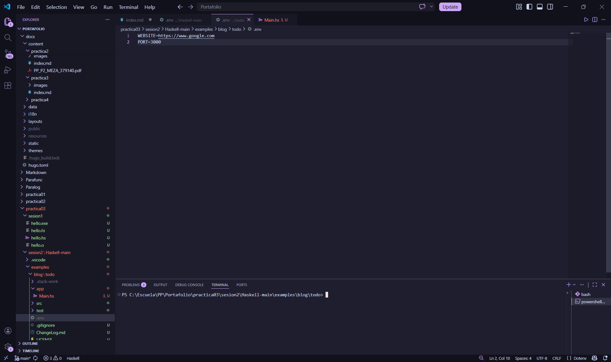
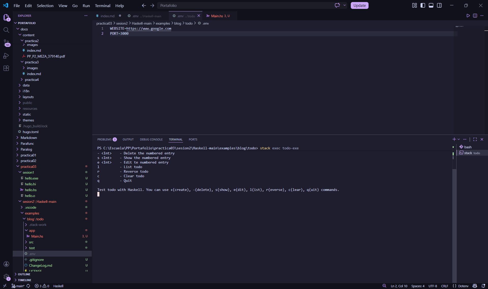
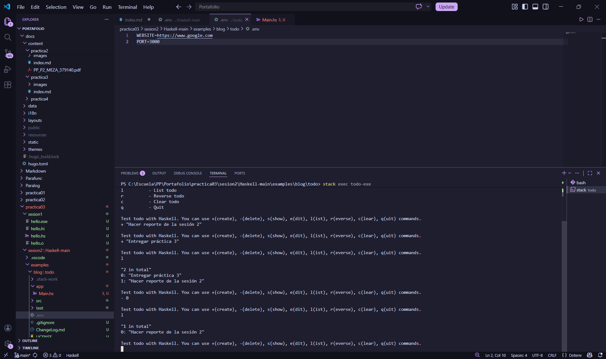

+++
date = '2026-02-20T23:15:23-08:00'
draft = false
title = 'Practica3: El paradigma funcional'
+++

## __Introduccion__

### __Contexto del Problema__
La gestion de tareas pendientes (To-Do List) requiere un sistema que garantice la integridad de los datos y una ejecucion libre de efectos secundarios inesperados. En lenguajes imperativos, la manipulación directa de estados globales suele generar errores dificiles de rastrear. El paradigma funcional ofrece una alternativa basada en la inmutabilidad y la evaluación de expresiones para construir sistemas mas robustos.

### __Objetivos__
- Implementar una aplicacion de gestion de tareas utilizando el lenguaje funcional Haskell.
- Gestionar el ciclo de vida del proyecto mediante la herramienta Stack.
- Validar conceptos clave del paradigma funcional: Inmutabilidad, Funciones de Orden Superior, Tipos de Datos Algebraicos y el manejo de Entrada/Salida.


## __Modelo del Dominio__

### __Arquitectura del sistema__
El diseño se centra en un flujo de datos puramente funcional donde el estado de la lista de tareas no se modifica, sino que se transforma a través de funciones. Se utiliza la librería dotenv para la carga de configuraciones externas y System.IO para la interacción con el usuario.

### __Funciones del sistema y Responsabilidades__

- __Main:__ Orquestador que inicializa el entorno, carga variables desde .env y gestiona el bucle interactivo.
- __lookupEnv:__ Funcion encargada de validar la existencia de variables de configuración, devolviendo un tipo Maybe para garantizar seguridad.
- __openBrowser:__ Acción de IO que permite la integracion del programa con servicios externos del sistema operativo.
- __Manejo de Comandos (+, -, l, s):__ Logica encargada de transformar la lista de tareas basandose en la entrada del usuario.


## __Evidencia de Conceptos Funcionales__

### __Manejo de Opcionales (Maybe)__
Se implemento el uso del tipo Maybe para gestionar variables de entorno, obligando al sistema a manejar explicitamente el caso de datos ausentes (Nothing) antes de continuar.

```haskell

case website of
    Nothing -> error "You should set WEBSITE at .env file."
    Just s -> do
        result <- openBrowser s

```

### __Inmutabilidad y Transformacion__
A diferencia de los arreglos en C, las listas en Haskell son inmutables. Cada comando de "agregar" o "eliminar" genera una nueva estructura de datos sin alterar la anterior.

### __Composicion y Monada IO__
El uso del bloque do permite secuenciar acciones que tienen efectos secundarios (como leer del teclado o escribir en pantalla) manteniendo la pureza del lenguaje en el resto de la lógica.

```haskell

main :: IO ()
main = do
    loadFile defaultConfig

```


## __Pruebas Manuales__






## __Coclusion__
Al terminar esta practica, lo mas interesante fue experimentar la seguridad que ofrece Haskell. En las practicas anteriores con C y Python, un error de configuración solía terminar en un "crash" o un comportamiento impredecible. Aquí, el sistema me obligó a definir correctamente el archivo .env mediante el uso de tipos como Maybe antes de siquiera permitir la ejecucio  n.

Entender que el codigo no "cambia" cosas, sino que "transforma" datos, cambia la perspectiva sobre como diseñar software. La separacion entre la logica pura y las acciones de IO hace que el codigo sea mucho más facil de razonar.

## __Referencias__ 

- Learn You a Haskell for Great Good!. http://learnyouahaskell.com/
- The Haskell Tool Stack. https://docs.haskellstack.org/en/stable/
- Hackage: dotenv. https://hackage.haskell.org/package/dotenv


## __Mis Enlaces__
* **Mi Portafolio en GitHub:** [https://github.com/kmeza1402/portafolio_PP]
* **Mi Página en Vivo:** [https://kmeza1402.github.io/portafolio_PP/practica3/]
