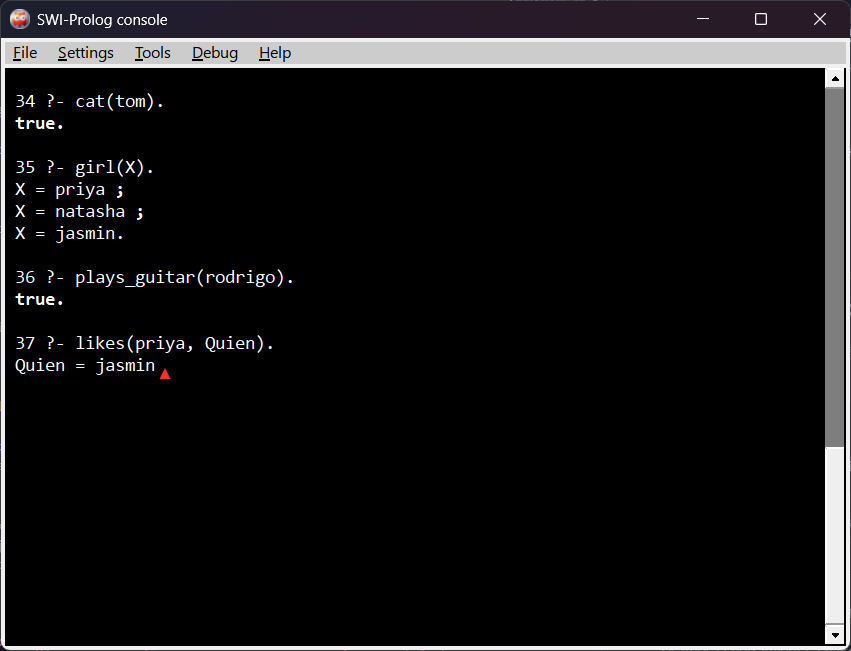
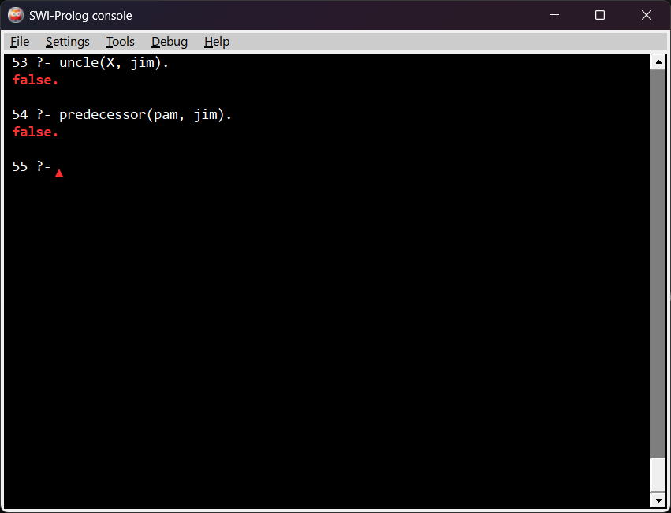
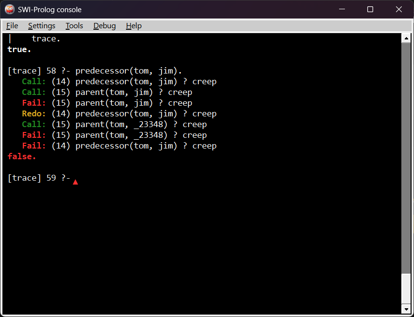
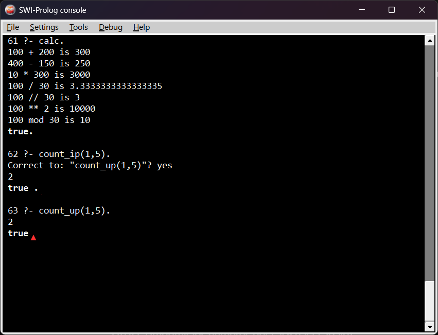
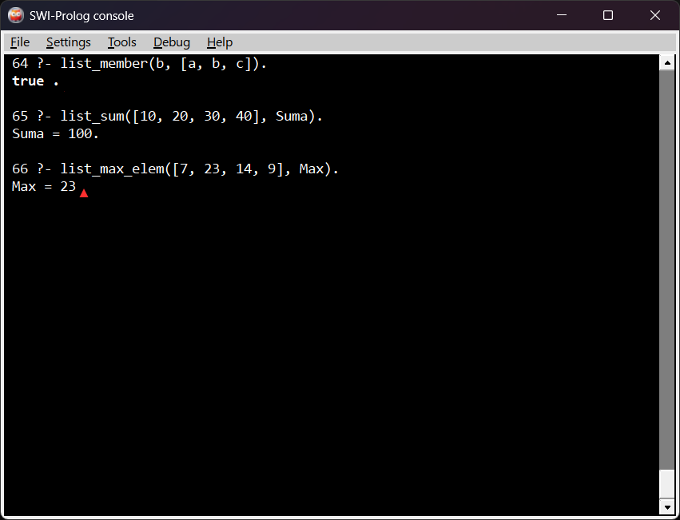
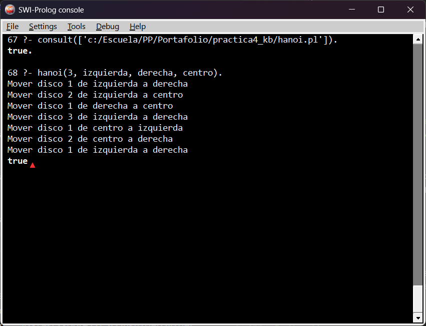
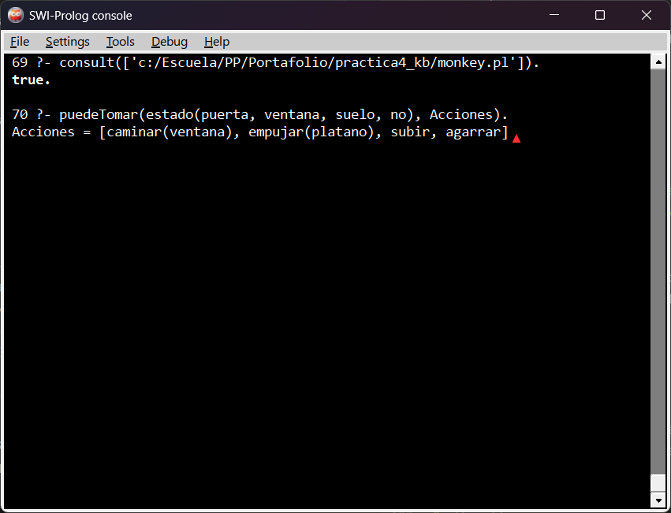

+++
date = '2026-02-20T23:15:41-08:00'
draft = false
title = 'Practica4: El paradigma logico'
+++

## __Introduccion__

### __Contexto del Problema__

Manejar relaciones complejas o consultar árboles genealógicos en lenguajes imperativos (como arreglos en C) puede ser un dolor de cabeza, porque terminas haciendo un montón de bucles anidados o funciones recursivas difíciles de seguir. El paradigma lógico nos da una alternativa declarativa: en lugar de escribir el algoritmo paso a paso para encontrar una solución, solo definimos los hechos y las reglas de nuestro entorno, dejando que un motor de inferencia haga todas las búsquedas por nosotros de forma automática.

En la tercera sesión escalamos ese razonamiento declarativo hacia problemas clásicos de inteligencia artificial: las **Torres de Hanoi** y el problema del **Mono y el Plátano**. Ambos son ejemplos canónicos de búsqueda en espacios de estados, donde Prolog brilla porque podemos describir el problema (las reglas del mundo y los movimientos válidos) sin tener que codificar explícitamente la estrategia de búsqueda.

### __Objetivos__

- Implementar bases de conocimientos estructuradas en hechos y reglas utilizando el lenguaje Prolog.
- Cargar y ejecutar código lógico de forma independiente mediante la consola de SWI-Prolog.
- Validar conceptos clave del paradigma: Unificación de variables, el mecanismo de Backtracking, recursión y la manipulación de listas usando la sintaxis `[Cabeza|Cola]`.
- Resolver problemas clásicos de IA (Torres de Hanoi y Mono & Plátano) modelándolos como búsqueda declarativa en un espacio de estados.

---

## __Modelo del Dominio__

### __Arquitectura del Sistema__

El diseño se basa en un flujo declarativo donde no modificamos variables globales ni estados en memoria. Creamos archivos con extensión `.pl` que contienen las verdades de nuestro problema y usamos el motor de SWI-Prolog para interrogar al sistema mediante consultas (Queries). El lenguaje se encarga de buscar las combinaciones correctas recorriendo un árbol de decisiones.

### __Funciones del Sistema y Responsabilidades__

- **`sesion1_completa.pl`**: Módulo inicial donde se definieron hechos simples y las primeras reglas lógicas de humor y gustos (Bases de conocimientos kb1, kb2 y kb3).
- **`family.pl` / `family_ext.pl` / `family_rec.pl`**: Lógica encargada de construir el árbol genealógico, resolviendo parentescos directos (padres, hermanos), extendidos (tíos, abuelos) y cadenas de ancestros con recursión.
- **`operadores.pl` / `loop.pl` / `option.pl`**: Archivos para el manejo de operaciones matemáticas con el operador `is`, bifurcaciones condicionales (If-Then-Else) y simulación de bucles numéricos.
- **`list_basics.pl` / `list_repos.pl` / `list_misc.pl`**: Biblioteca para el procesamiento de listas, encargada de operaciones como buscar elementos, calcular longitudes, sumar valores o encontrar el número máximo de una lista.
- **`hanoi.pl`**: Implementación recursiva del problema de las Torres de Hanoi. Define la estrategia de movimiento de discos entre tres postes (origen, auxiliar y destino) usando una sola regla recursiva.
- **`monkey.pl`**: Modelado del problema del Mono y el Plátano como un sistema de estados y acciones. Define el estado del mundo como un término compuesto y las acciones válidas (caminar, empujar la caja, subir, agarrar) como reglas que transforman ese estado.

---

## __Evidencia de Conceptos Lógicos__

### __Manejo de Unificación y Variables__

En Prolog, si usamos variables (palabras que empiezan con Mayúscula), el sistema intenta "unificarlas" o emparejarlas con los hechos de nuestro archivo. Si encuentra varias soluciones, nos permite verlas una por una.

```prolog
?- girl(X).
% El sistema busca y unifica X con lo que tiene registrado:
% X = priya ; X = natasha ; X = jasmin.
```

### __Recursión y Backtracking__

Cuando usamos una regla recursiva como `predecessor/2`, Prolog avanza buscando una ruta. Si se topa con un camino que no cumple la condición, activa el "backtracking" (regresa al último punto de decisión) y prueba con una regla alternativa hasta agotar las opciones o encontrar la respuesta.

```prolog
predecessor(X, Z) :- parent(X, Z).
predecessor(X, Z) :- parent(X, Y), predecessor(Y, Z).
```

### __Inmutabilidad en Listas__

Al igual que en Haskell, las listas en Prolog no se modifican directamente. Usamos la sintaxis `[Head|Tail]` (Cabeza y Cola) para separar el primer elemento del resto de la lista, procesándolo de forma recursiva para generar nuevos resultados sin alterar la estructura original.

```prolog
list_sum([], 0).
list_sum([Head|Tail], Sum) :- list_sum(Tail, SumTemp), Sum is Head + SumTemp.
```

### __Búsqueda en Espacios de Estados (Sesión 3)__

Los dos problemas de la tercera sesión comparten la misma idea de fondo: el mundo tiene un **estado inicial**, un **estado objetivo** y un conjunto de **acciones** que lo transforman. Prolog no necesita que le digamos cómo llegar; simplemente busca —con backtracking— una secuencia de acciones que conecte ambos extremos.

**Torres de Hanoi** — la solución se expresa con una única regla recursiva. El caso base mueve un solo disco directamente al destino. El caso recursivo descompone el problema: mover N-1 discos al poste auxiliar, mover el disco más grande al destino y luego mover los N-1 discos del auxiliar al destino.

```prolog
% Caso base: mover un solo disco
hanoi(1, Origen, Destino, _) :-
    format("Mover disco 1 de ~w a ~w~n", [Origen, Destino]).

% Caso recursivo: N discos
hanoi(N, Origen, Destino, Auxiliar) :-
    N > 1,
    N1 is N - 1,
    hanoi(N1, Origen, Auxiliar, Destino),
    format("Mover disco ~w de ~w a ~w~n", [N, Origen, Destino]),
    hanoi(N1, Auxiliar, Destino, Origen).
```

**Mono y el Plátano** — el estado del mundo se codifica como el término `estado(PosMonkey, PosBox, Altura, TienePlatano)`. Cada acción es una regla que transforma un estado en el siguiente. La consulta `puedeTomar(estado(...), Acciones)` hace que Prolog busque la secuencia de movimientos hasta alcanzar el estado donde el mono tiene el plátano.

```prolog
% Caso final: el mono ya tiene el plátano
puedeTomar(estado(_, _, _, si), []).

% Acción 1: el mono camina hacia donde está la caja
puedeTomar(estado(PosM, PosB, suelo, no), [caminar(PosB)|Resto]) :-
    PosM \== PosB,
    puedeTomar(estado(PosB, PosB, suelo, no), Resto).

% Acción 2: el mono empuja la caja hacia el plátano
puedeTomar(estado(Pos, Pos, suelo, no), [empujar(platano)|Resto]) :-
    Pos \== platano,
    puedeTomar(estado(platano, platano, suelo, no), Resto).

% Acción 3: el mono sube a la caja
puedeTomar(estado(platano, platano, suelo, no), [subir|Resto]) :-
    puedeTomar(estado(platano, platano, caja, no), Resto).

% Acción 4: el mono agarra el plátano
puedeTomar(estado(platano, platano, caja, no), [agarrar]) :-
    puedeTomar(estado(platano, platano, caja, si), []).
```

---

## __Pruebas Manuales__

### __1. Carga de Archivos y Hechos Básicos (Sesión 1)__

Probamos la base de conocimientos unificada comprobando un hecho directo y haciendo una consulta con variable.

```prolog
?- [sesion1_completa].
?- cat(tom).
?- girl(X).
```



---

### __2. Consultas del Árbol Genealógico__

Verificamos que las reglas extendidas del árbol familiar puedan deducir relaciones de tíos y ancestros.

```prolog
?- [family_ext].
?- uncle(X, jim).
?- predecessor(pam, jim).
```



---

### __3. Rastreo del Flujo con el Comando Trace__

Usamos la herramienta `trace` para ver exactamente el paso a paso que hace Prolog en la consola al resolver la recursión.

```prolog
?- trace.
?- predecessor(tom, jim).
```



---

### __4. Operadores Matemáticos y Bucles__

Validación del funcionamiento de las operaciones aritméticas y los rangos numéricos iterativos.

```prolog
?- [operadores].
?- calc.
?- [loop].
?- count_up(1, 5).
```



---

### __5. Operaciones Avanzadas con Listas__

Prueba de las funciones para verificar membresía, sumas acumuladas y búsqueda de elementos máximos dentro de colecciones.

```prolog
?- [list_basics].
?- list_member(b, [a, b, c]).
?- [list_misc].
?- list_sum([10, 20, 30, 40], Suma).
?- list_max_elem([7, 23, 14, 9], Max).
```



---

### __6. Torres de Hanoi__

Verificamos que la solución recursiva genera la secuencia correcta de movimientos para 3 discos. El resultado esperado son exactamente 7 movimientos (2³ − 1), que Prolog calcula solo a partir de la regla recursiva.

```prolog
?- [hanoi].
?- hanoi(3, izquierda, derecha, centro).
```



---

### __7. El Mono y el Plátano__

Probamos que Prolog encuentra por sí solo la secuencia de acciones que lleva al mono desde el estado inicial hasta agarrar el plátano. No le decimos cómo hacerlo; solo le preguntamos si puede, y él construye el plan.

```prolog
?- [monkey].
?- puedeTomar(estado(puerta, ventana, suelo, no), Acciones).
```



---

## __Conclusión__

Al terminar esta práctica, lo más interesante fue el "cambio de chip" frente a C y Haskell: en lugar de estructurar el flujo exacto de pasos, en Prolog solo se definen hechos y reglas, delegando la búsqueda de soluciones al motor de inferencia. En este proceso, la herramienta trace resultó clave para entender el backtracking en tiempo real al visualizar cómo el sistema toma decisiones y retrocede ante rutas fallidas.

Por su parte, la Sesión 3 llevó este razonamiento a un nivel aplicado. Las Torres de Hanoi evidenciaron que la recursión es la forma natural de descomponer problemas, mientras que el caso del Mono y el Plátano introdujo el modelado de estados y la planificación automática, donde el lenguaje encuentra solo el orden correcto de las acciones. Esta capacidad de búsqueda en espacios de estados es la base de los sistemas expertos y la inteligencia artificial, manteniendo la total vigencia de este paradigma.

---

## Referencias

- Clocksin, W. F., & Mellish, C. S. (2003). *Programming in Prolog*. Springer Science & Business Media.
- Gallegos Mariscal, J. C. (2026). *Práctica IV: El paradigma lógico*. Material didáctico de Paradigmas de la Programación. Mexicali/Ensenada: UABC FIAD.
- Russell, S., & Norvig, P. (2020). *Artificial Intelligence: A Modern Approach* (4th ed.). Pearson.
- SWI-Prolog Official Documentation and Reference Manual. <https://www.swi-prolog.org/>

---

## Mis Enlaces

- **Mi Portafolio en GitHub:** [kmeza1402/portafolio_PP](https://github.com/kmeza1402/portafolio_PP)
- **Mi Página en Vivo:** [kmeza1402.github.io/portafolio_PP/practica4](https://kmeza1402.github.io/portafolio_PP/)